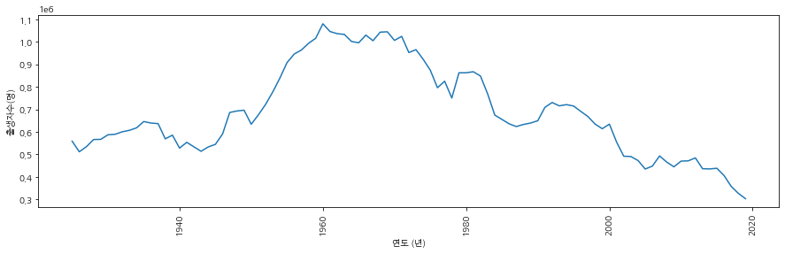
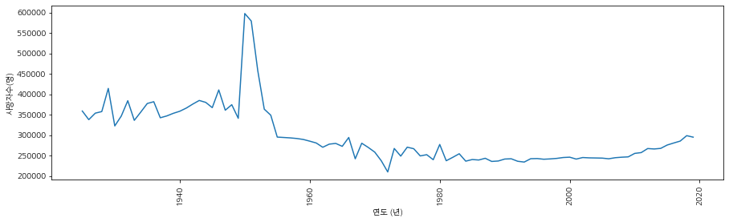
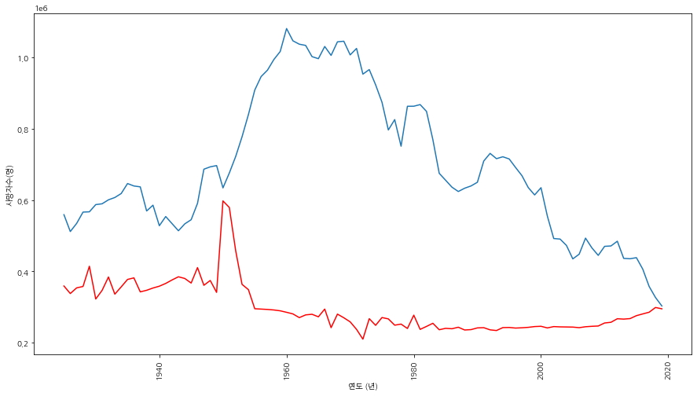
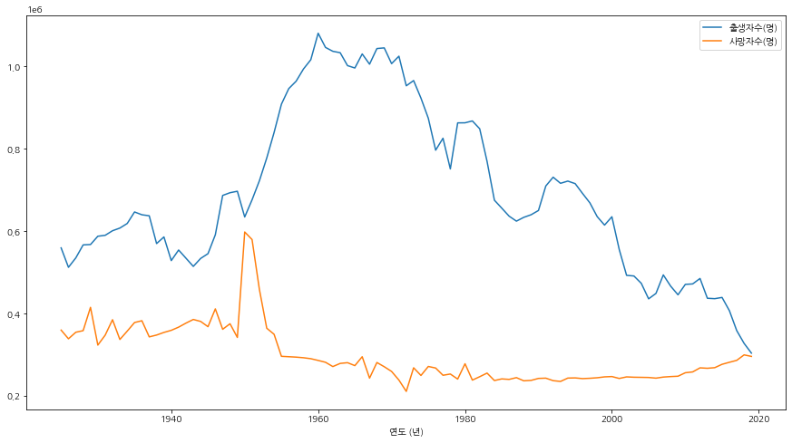
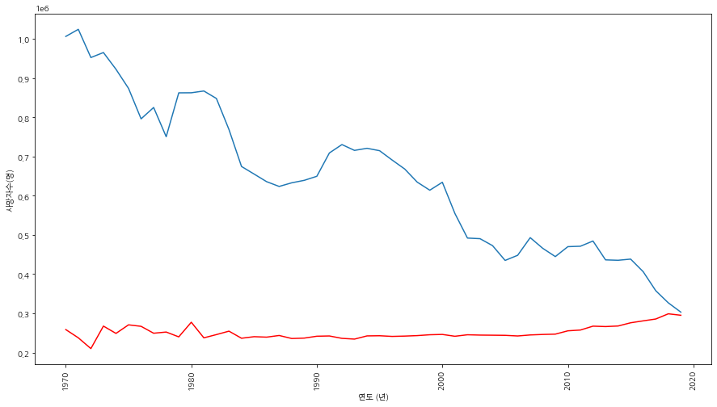
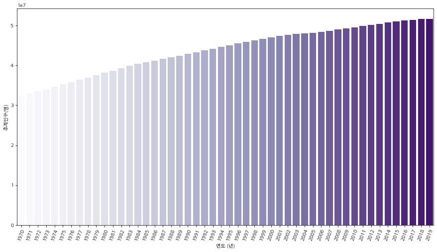
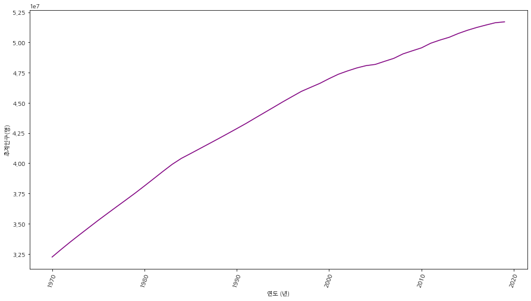

## Wikipedai에 명시되어 있는 대한민국 인구통계  데이터 분석

패키지 임포트 및 URL 가져오기


```python
import pandas as pd
import matplotlib.pyplot as plt
import seaborn as sns

```


```python
url = 'https://ko.wikipedia.org/wiki/%EB%8C%80%ED%95%9C%EB%AF%BC%EA%B5%AD%EC%9D%98_%EC%9D%B8%EA%B5%AC'
```


```python
table = pd.read_html(url)
```

테이블 길이 체크하기


```python
len(table)
```


    3


테이블 살펴보기


```python
table[0]
```


<div>
<style scoped>
    .dataframe tbody tr th:only-of-type {
        vertical-align: middle;
    }

    .dataframe tbody tr th {
        vertical-align: top;
    }

    .dataframe thead th {
        text-align: right;
    }
</style>
<table border="1" class="dataframe">
  <thead>
    <tr style="text-align: right;">
      <th></th>
      <th>구간</th>
      <th>연평균 출생아수</th>
      <th>연평균 사망자수</th>
      <th>연평균 자연증가</th>
      <th>조출생률</th>
      <th>조사망률</th>
      <th>자연증가율</th>
      <th>합계출산율</th>
      <th>영아사망률</th>
    </tr>
  </thead>
  <tbody>
    <tr>
      <th>0</th>
      <td>1950–1955</td>
      <td>722000</td>
      <td>331000</td>
      <td>391000</td>
      <td>35.8</td>
      <td>16.4</td>
      <td>19.4</td>
      <td>5.05</td>
      <td>138.0</td>
    </tr>
    <tr>
      <th>1</th>
      <td>1955–1960</td>
      <td>1049000</td>
      <td>356000</td>
      <td>693000</td>
      <td>45.4</td>
      <td>15.4</td>
      <td>30.0</td>
      <td>6.33</td>
      <td>114.4</td>
    </tr>
    <tr>
      <th>2</th>
      <td>1960–1965</td>
      <td>1067000</td>
      <td>347000</td>
      <td>720000</td>
      <td>39.9</td>
      <td>13.0</td>
      <td>27.0</td>
      <td>5.63</td>
      <td>89.7</td>
    </tr>
    <tr>
      <th>3</th>
      <td>1965–1970</td>
      <td>985000</td>
      <td>298000</td>
      <td>687000</td>
      <td>32.9</td>
      <td>9.9</td>
      <td>23.0</td>
      <td>4.71</td>
      <td>64.2</td>
    </tr>
    <tr>
      <th>4</th>
      <td>1970–1975</td>
      <td>1004000</td>
      <td>259000</td>
      <td>746000</td>
      <td>30.4</td>
      <td>7.8</td>
      <td>22.5</td>
      <td>4.28</td>
      <td>38.1</td>
    </tr>
    <tr>
      <th>5</th>
      <td>1975–1980</td>
      <td>833000</td>
      <td>253000</td>
      <td>581000</td>
      <td>23.1</td>
      <td>7.0</td>
      <td>16.1</td>
      <td>2.92</td>
      <td>33.2</td>
    </tr>
    <tr>
      <th>6</th>
      <td>1980–1985</td>
      <td>795000</td>
      <td>248000</td>
      <td>547000</td>
      <td>20.4</td>
      <td>6.4</td>
      <td>14.0</td>
      <td>2.23</td>
      <td>24.6</td>
    </tr>
    <tr>
      <th>7</th>
      <td>1985–1990</td>
      <td>647000</td>
      <td>239000</td>
      <td>407000</td>
      <td>15.5</td>
      <td>5.7</td>
      <td>9.8</td>
      <td>1.60</td>
      <td>14.9</td>
    </tr>
    <tr>
      <th>8</th>
      <td>1990–1995</td>
      <td>702000</td>
      <td>239000</td>
      <td>463000</td>
      <td>16.0</td>
      <td>5.5</td>
      <td>10.6</td>
      <td>1.70</td>
      <td>9.7</td>
    </tr>
    <tr>
      <th>9</th>
      <td>1995–2000</td>
      <td>615000</td>
      <td>247000</td>
      <td>368000</td>
      <td>13.6</td>
      <td>5.5</td>
      <td>8.1</td>
      <td>1.51</td>
      <td>6.6</td>
    </tr>
    <tr>
      <th>10</th>
      <td>2000–2005</td>
      <td>476000</td>
      <td>245000</td>
      <td>231000</td>
      <td>10.2</td>
      <td>5.3</td>
      <td>5.0</td>
      <td>1.22</td>
      <td>5.3</td>
    </tr>
    <tr>
      <th>11</th>
      <td>2005–2010</td>
      <td>477000</td>
      <td>243000</td>
      <td>234000</td>
      <td>10.0</td>
      <td>5.1</td>
      <td>4.9</td>
      <td>1.29</td>
      <td>3.8</td>
    </tr>
    <tr>
      <th>12</th>
      <td>2010–2015</td>
      <td>455000</td>
      <td>275000</td>
      <td>180000</td>
      <td>NaN</td>
      <td>NaN</td>
      <td>NaN</td>
      <td>1.26</td>
      <td>NaN</td>
    </tr>
  </tbody>
</table>
</div>


```python
table[1]
```


<div>
<style scoped>
    .dataframe tbody tr th:only-of-type {
        vertical-align: middle;
    }

    .dataframe tbody tr th {
        vertical-align: top;
    }

    .dataframe thead th {
        text-align: right;
    }
</style>
<table border="1" class="dataframe">
  <thead>
    <tr style="text-align: right;">
      <th></th>
      <th>연도 (년)</th>
      <th>추계인구(명)</th>
      <th>출생자수(명)</th>
      <th>사망자수(명)</th>
      <th>자연증가수(명)</th>
      <th>조출생률(%)</th>
      <th>조사망률(%)</th>
      <th>자연증가율(%)</th>
      <th>합계출산율(%)</th>
    </tr>
  </thead>
  <tbody>
    <tr>
      <th>0</th>
      <td>1925</td>
      <td>12997611</td>
      <td>558897</td>
      <td>359042</td>
      <td>199855</td>
      <td>43.0</td>
      <td>27.6</td>
      <td>15.4</td>
      <td>6.59</td>
    </tr>
    <tr>
      <th>1</th>
      <td>1926</td>
      <td>13052741</td>
      <td>511667</td>
      <td>337948</td>
      <td>173719</td>
      <td>39.2</td>
      <td>25.9</td>
      <td>13.3</td>
      <td>NaN</td>
    </tr>
    <tr>
      <th>2</th>
      <td>1927</td>
      <td>13037169</td>
      <td>534524</td>
      <td>353818</td>
      <td>180706</td>
      <td>41.0</td>
      <td>27.1</td>
      <td>13.9</td>
      <td>NaN</td>
    </tr>
    <tr>
      <th>3</th>
      <td>1928</td>
      <td>13105131</td>
      <td>566142</td>
      <td>357701</td>
      <td>208441</td>
      <td>43.2</td>
      <td>27.3</td>
      <td>15.9</td>
      <td>NaN</td>
    </tr>
    <tr>
      <th>4</th>
      <td>1929</td>
      <td>13124279</td>
      <td>566969</td>
      <td>414366</td>
      <td>152603</td>
      <td>43.2</td>
      <td>31.6</td>
      <td>11.6</td>
      <td>NaN</td>
    </tr>
    <tr>
      <th>...</th>
      <td>...</td>
      <td>...</td>
      <td>...</td>
      <td>...</td>
      <td>...</td>
      <td>...</td>
      <td>...</td>
      <td>...</td>
      <td>...</td>
    </tr>
    <tr>
      <th>90</th>
      <td>2015</td>
      <td>51014947</td>
      <td>438420</td>
      <td>275895</td>
      <td>162925</td>
      <td>8.6</td>
      <td>5.4</td>
      <td>3.2</td>
      <td>1.24</td>
    </tr>
    <tr>
      <th>91</th>
      <td>2016</td>
      <td>51245707</td>
      <td>406243</td>
      <td>280827</td>
      <td>125416</td>
      <td>7.9</td>
      <td>5.5</td>
      <td>2.4</td>
      <td>1.17</td>
    </tr>
    <tr>
      <th>92</th>
      <td>2017</td>
      <td>51446201</td>
      <td>357771</td>
      <td>285534</td>
      <td>72237</td>
      <td>7.0</td>
      <td>5.5</td>
      <td>1.5</td>
      <td>1.05</td>
    </tr>
    <tr>
      <th>93</th>
      <td>2018</td>
      <td>51635256</td>
      <td>326822</td>
      <td>298820</td>
      <td>28002</td>
      <td>6.4</td>
      <td>5.8</td>
      <td>0.6</td>
      <td>0.98</td>
    </tr>
    <tr>
      <th>94</th>
      <td>2019</td>
      <td>51709098</td>
      <td>303054</td>
      <td>295132</td>
      <td>7922</td>
      <td>5.9</td>
      <td>5.7</td>
      <td>0.2</td>
      <td>0.92</td>
    </tr>
  </tbody>
</table>
<p>95 rows × 9 columns</p>
</div>


```python
table[2]
```


<div>
<style scoped>
    .dataframe tbody tr th:only-of-type {
        vertical-align: middle;
    }

    .dataframe tbody tr th {
        vertical-align: top;
    }

    .dataframe thead th {
        text-align: right;
    }
</style>
<table border="1" class="dataframe">
  <thead>
    <tr style="text-align: right;">
      <th></th>
      <th>vte아시아의 인구</th>
      <th>vte아시아의 인구.1</th>
      <th>vte아시아의 인구.2</th>
    </tr>
  </thead>
  <tbody>
    <tr>
      <th>0</th>
      <td>독립국</td>
      <td>네팔 대한민국 동티모르[* 1] 라오스 러시아[* 2] 레바논 말레이시아 몰디브 몽...</td>
      <td>NaN</td>
    </tr>
    <tr>
      <th>1</th>
      <td>자치구</td>
      <td>마카오[* 6] 차고스 제도 [* 7] 티베트[* 8] 위구르[* 8] 홍콩[* 6]</td>
      <td>NaN</td>
    </tr>
    <tr>
      <th>2</th>
      <td>미승인 국가</td>
      <td>아르차흐 공화국[* 2] 남오세티야[* 2] 북키프로스[* 3] 압하지야[* 2]</td>
      <td>NaN</td>
    </tr>
    <tr>
      <th>3</th>
      <td>↑ 오세아니아에 속하는 국가로 분류되는 경우도 있다. ↑ 가 나 다 라 마 바 사 ...</td>
      <td>↑ 오세아니아에 속하는 국가로 분류되는 경우도 있다. ↑ 가 나 다 라 마 바 사 ...</td>
      <td>NaN</td>
    </tr>
    <tr>
      <th>4</th>
      <td>분류</td>
      <td>분류</td>
      <td>분류</td>
    </tr>
  </tbody>
</table>
</div>


1번 테이블을 활용하여 분석 수행


```python
df = table[1]
```


```python
df.tail()
```


<div>
<style scoped>
    .dataframe tbody tr th:only-of-type {
        vertical-align: middle;
    }

    .dataframe tbody tr th {
        vertical-align: top;
    }

    .dataframe thead th {
        text-align: right;
    }
</style>
<table border="1" class="dataframe">
  <thead>
    <tr style="text-align: right;">
      <th></th>
      <th>연도 (년)</th>
      <th>추계인구(명)</th>
      <th>출생자수(명)</th>
      <th>사망자수(명)</th>
      <th>자연증가수(명)</th>
      <th>조출생률(%)</th>
      <th>조사망률(%)</th>
      <th>자연증가율(%)</th>
      <th>합계출산율(%)</th>
    </tr>
  </thead>
  <tbody>
    <tr>
      <th>90</th>
      <td>2015</td>
      <td>51014947</td>
      <td>438420</td>
      <td>275895</td>
      <td>162925</td>
      <td>8.6</td>
      <td>5.4</td>
      <td>3.2</td>
      <td>1.24</td>
    </tr>
    <tr>
      <th>91</th>
      <td>2016</td>
      <td>51245707</td>
      <td>406243</td>
      <td>280827</td>
      <td>125416</td>
      <td>7.9</td>
      <td>5.5</td>
      <td>2.4</td>
      <td>1.17</td>
    </tr>
    <tr>
      <th>92</th>
      <td>2017</td>
      <td>51446201</td>
      <td>357771</td>
      <td>285534</td>
      <td>72237</td>
      <td>7.0</td>
      <td>5.5</td>
      <td>1.5</td>
      <td>1.05</td>
    </tr>
    <tr>
      <th>93</th>
      <td>2018</td>
      <td>51635256</td>
      <td>326822</td>
      <td>298820</td>
      <td>28002</td>
      <td>6.4</td>
      <td>5.8</td>
      <td>0.6</td>
      <td>0.98</td>
    </tr>
    <tr>
      <th>94</th>
      <td>2019</td>
      <td>51709098</td>
      <td>303054</td>
      <td>295132</td>
      <td>7922</td>
      <td>5.9</td>
      <td>5.7</td>
      <td>0.2</td>
      <td>0.92</td>
    </tr>
  </tbody>
</table>
</div>


```python
plt.figure(figsize=(15,4))
plt.xticks(rotation=90)
sns.lineplot(data=df,x='연도 (년)',y='추계인구(명)')
```


    <AxesSubplot:xlabel='연도 (년)', ylabel='추계인구(명)'>


```python
plt.figure(figsize=(15,4))
plt.xticks(rotation=90)
sns.lineplot(data=df,x='연도 (년)',y='출생자수(명)')
```


    <AxesSubplot:xlabel='연도 (년)', ylabel='출생자수(명)'>





```python
plt.figure(figsize=(15,4))
plt.xticks(rotation=90)
sns.lineplot(data=df,x='연도 (년)',y='사망자수(명)')
```


    <AxesSubplot:xlabel='연도 (년)', ylabel='사망자수(명)'>





```python
plt.figure(figsize=(15,8))
plt.xticks(rotation=90)
sns.lineplot(data=df,x='연도 (년)',y='출생자수(명)')
sns.lineplot(data=df,x='연도 (년)',y='사망자수(명)', color='red')
```


    <AxesSubplot:xlabel='연도 (년)', ylabel='사망자수(명)'>





```python
df.columns
```


    Index(['연도 (년)', '추계인구(명)', '출생자수(명)', '사망자수(명)', '자연증가수(명)', '조출생률(%)',
           '조사망률(%)', '자연증가율(%)', '합계출산율(%)'],
          dtype='object')


```python
df_pop = df[['연도 (년)','출생자수(명)', '사망자수(명)' ]]
df_pop = df_pop.set_index('연도 (년)')
```


```python
df_pop.plot(figsize=(15,8), )
```


    <AxesSubplot:xlabel='연도 (년)'>





최근 과거 50년만 슬라이싱해서 분석


```python
df_pop[-50:].plot(figsize=(15,8))
```


    <AxesSubplot:xlabel='연도 (년)'>


```python
plt.figure(figsize=(15,8))
plt.xticks(rotation=90)
sns.lineplot(data=df[-50:],x='연도 (년)',y='출생자수(명)')
sns.lineplot(data=df[-50:],x='연도 (년)',y='사망자수(명)', color='red')
```


    <AxesSubplot:xlabel='연도 (년)', ylabel='사망자수(명)'>





```python

```


```python
plt.figure(figsize=(15,8))
plt.xticks(rotation=70)
sns.barplot(data=df[-50:], x='연도 (년)', y='추계인구(명)', palette='Purples')
```


    <AxesSubplot:xlabel='연도 (년)', ylabel='추계인구(명)'>





```python
plt.figure(figsize=(15,8))
plt.xticks(rotation=70)
sns.pointplot(data=df[-50:], x='연도 (년)', y='추계인구(명)', palette='Purples')
```


    <AxesSubplot:xlabel='연도 (년)', ylabel='추계인구(명)'>


```python
plt.figure(figsize=(15,8))
plt.xticks(rotation=70)
sns.lineplot(data=df[-50:], x='연도 (년)', y='추계인구(명)', color='purple')
```


    <AxesSubplot:xlabel='연도 (년)', ylabel='추계인구(명)'>





```python
## End of Document
```
